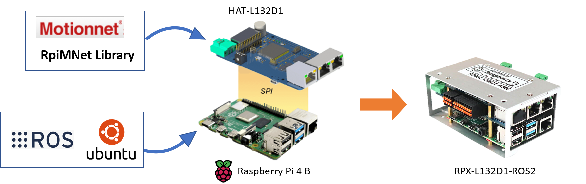
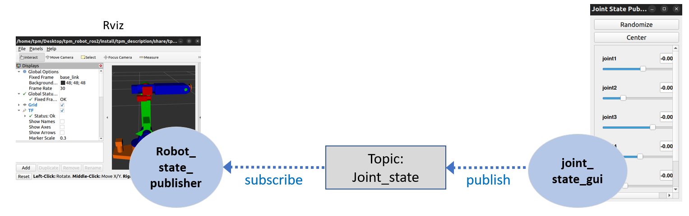

# tpm_robot_ros2
**ROS2(Robot Operating System)** is a set of software libraries and tools for building robot applications. This repository is a **ROS2** node driver for using **TPM RPX-L132D1-ROS2** controller to control robot. It provides nodes to communicate with Motionnet drivers and to perform the kinematics and CAD modules for several robots.

## Overview
The TPM robot control system using **RPX-L132D1-ROS2** can be divided into four parts:
1. Robot Mechanics: the mechanical parts of robot. The recent supported robots are:
    - igus_scara_4dof
    - igus_delta_3dof
    - igus_robolink_5dof
    - ar3
2. Drivers:TPM SVR-M1xx series or other Motionnet Slave drivers to control motors.
3. Controller(RPX-L132D1-ROS2): a Raspberry Pi operating ROS2 nodes with Motionnet Master add-on board HAT-L132D1 to control drivers through Motionnet Fieldbus.

4. Programming environment: interfaces for user to receive status and send commands to axes and robot such as MyRosRobot, Moveit or C++ and python APIs.

This repository contains the software for the controller and the programming environment. Here simply describes the functions of each component of this repository. Users may reach the corresponding chapters of components for further understanding in their concern.
- **tpm_core_node**: processes all the core functions of the controller to execute commands from users and monitor the statuses of axes.
- **tpm_sample_code**: provides C++ and python APIs and a GUI called **MyRosRobot** for users to call services from **tpm_core_node**.
- **tpm_description**: contains 3D simulation related config files for Rviz.
- **tpm_moveit**: contains the message and service definitions.
- **tpm_msgs**: contains the message and service definitions.
- **Doc**: contains figures for Readme files and explanation of topics and services in this repository.

Here introduce three configurations of nodes for users to meet their demands. Detailed usages of each configuration are provided in the next chapter. For users willing to develop ROS2 nodes to call services from tpm_core_node directly, please refer to .
### Node Configurations
1. Using TPM Library
MyRosRobot is a sample GUI made by TPM. It presents commands for both kinematical movements to robot and controls to axes to tpm_core_node. The status of each axis will also be shown on MyRosRobot. To observe 3D perception of the robot, Rviz in tpm_description presents the posture of the robot according to the joint_state published by tpm_core_node.

2. Using Moveit Platform
Moveit2 is the robotic manipulation platform for ROS2 (by moveit official website). It contains functions such as motion planning, 3D perception (Rviz) and collision checking. For users willing to use Moveit2 to control robots, tpm_core_node can also operate joint trajectory from Move_group node by calling action follow_joint_trajectory. It should be noted that in this configuration, commands for drivers such as ServoOn and Home still need to be called by using MyRosRobot.

3. Using Joint State Publisher
ROS2 provides a GUI called Joint State Publisher for users to observe and move the 3D modules in Rviz. Users cannot control the robot by using Joint State Publisher. The movement of 3D modules may also be different from using TPM libraries or Moveit.

