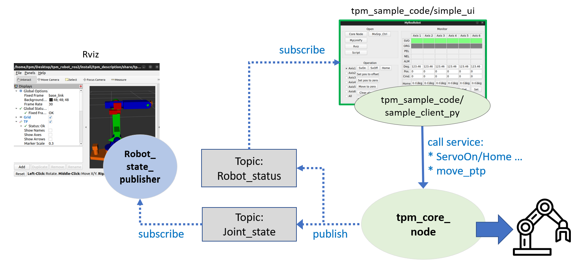
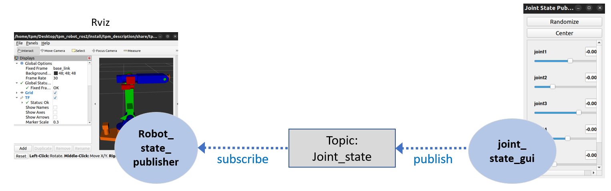

# tpm_core_node
This part aims to provide the usage of the three node configurations of the control software introduced in the previous chapter. Please refer to 1.1 Overview for quick understanding of different node configurations.
The three node configurations could be launched by entering the following command into the terminal:
```
ros2 launch tpm_core_node <launch_file> robot_name:=<robot_name> sim use_sim_time:=<true/false>
```
- <launch_file> should always be specified. It determines the node configuration to launch.
- <robot_name> is used to load the corresponding kinematics and CAD files of the selected robot. The supported robots are:
    - igus_scara_4dof
    - igus_delta_3dof
    - igus_delta_3dof
    - ar3
- <use_sim_time> is to choose to connect to controllers to control a real robot or just start a 3D perception to simulate. Set the value as true for simulation and false to control a robot in reality.

## Using TPM Library
To control a robot using TPM library, enter the following command into the terminal:
```
ros2 launch tpm_core_node demo.launch.py
```
sample_ui and Rviz windows would pop-up as shown below.



On MyRosRobot, choose the axis to control with commands on the left buttom corner such as SvOn, SvOff and Home. The status of each axis would be shown on the right side.

In Rivz, the current posture of the robot would be shown on the right side.

## Using Moveit! Platform
To start the node configuration using Moveit platform to control a robot, enter the following command into the terminal:
```
ros2 launch tpm_core_node demo_moveit.launch.py
```
MyRosRobot and Rviz(with moveit) windows would pop-up as shown below.


The usage of MyRosRobot is the same as in the previous section [Using TPM Library](#using-tpm-library).
For the usage of Moveit, please refer to the [Moveit official website]().

## Using Joint State Publisher
Enter the following command into the terminal to launch Rviz with JointStatePublisher:
```
ros2 launch tpm_core_node pure_rviz.launch.py
```
JointStatePublisher and Rviz windows would pop-up as shown below.



Move the slot to move the components of the robot in Rviz.

## Ros2 Interfaces
The package of tpm_core_node is the library for robot kinematics and controllers and their config files.
To call services from the package, users may:
- Develop their own ROS2 nodes with the ROS2 interfaces provided below.
- Use MyRosRobot or Moveit! interfaces. Please refer to [Using TPM Library](#using-tpm-library) or [Using Moveit Platform](#using-moveit-platform).
- Use python and C++ APIs. Please refer to .

ROS2 provides four kinds of interface to transmit datas between nodes under different conditions. Here provide the interfaces contained in tpm_core_node.
*It should be noted that the axis ID is 0 for Axis, 1 for Axis 2 and so on while axis ID -1 corresponds to all axes.
1. Actions
- handle_ftj_accepted: receive joint_trajectory from Move Group node and send corresponding command to controllers.
- handle_ftj_goal:
- handle_ftj_cancel:
2. Parameters
- Parameters for axes:
    - alm_logic
    - org_logic
    - feedback_src
    - home_mode
    - home_offsets
    - home_dir
    - max_jog_speed
    - pulse_per_deg
    - pos_limit
    - neg_limit
    - pulse_per_unit

- Parameters for robot kinematics
    - robot_type
    - a
    - alpha
    - d
    - theta
    - theta_shift

3. Services
- axis_operation: indicates the operation function to be called
- set_axis_param: set the home offset of the target axis
- set_robot_param: set the moving speed and distance of the robot for Jogging
- robStop: stop the robot in specific modes
- robMovePTP: set the movement profile such as initial velocity and acceleration
- robGetAxis: get the instant positions and coordinates of each axis
- robGetBuffDepth: 
4. Topics
- timerCallback_robotStatus: get the positions and coordinates of each axis periodically.
- timerCallback_jointState: get the status of each joint periodically.
